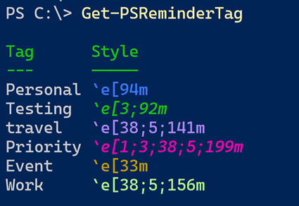
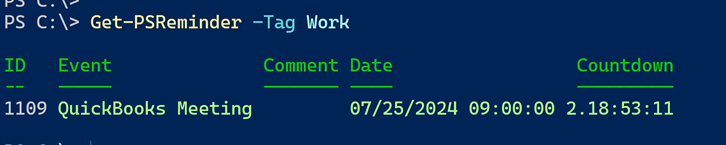
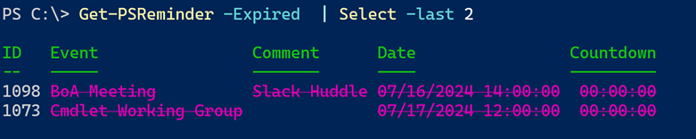
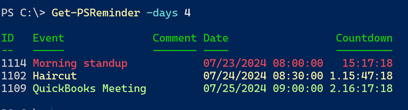
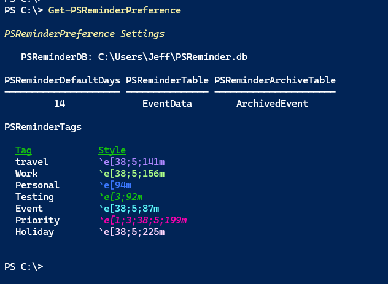
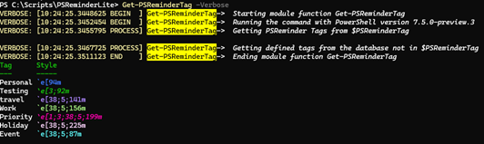

# PSReminderLite

[](https://www.powershellgallery.com/packages/PSReminderLite/) [](https://www.powershellgallery.com/packages/PSReminderLite/)

## :calendar: Introduction

This module is a port of the [MyTickle] module. The original module used an instance of SQLServer Express to provide a database of event reminders. This version uses SQLite to provide the same functionality. When you install the module from the PowerShell Gallery, it will also install the [MySqlite] module if it isn't already installed.

```powershell
Install-Module PSReminderLite
```

OR

```powershell
Install-PSResource PSReminderLite
```

The module requires a 64-bit PowerShell 7 platform.

>*The module has not been tested extensively on non-windows platforms*.

Once the module is installed, you can run `Get-AboutPSReminder` to see the module information.

```shell
PS C:\> Get-AboutPSReminder

ModuleName    : PSReminderLite
Version       : 1.0.0
MySQLite      : 0.13.0
SQLiteVersion : 3.42.0
PSVersion     : 7.4.4
Platform      : Win32NT
Host          : ConsoleHost
```

This may be helpful when filing an issue or asking for help.

##  Module Commands

All module commands should have full help with examples. The `About` help topic is a subset of this document.

- [Add-PSReminder](docs/Add-PSReminder.md)
- [Export-PSReminderDatabase](docs/Export-PSReminderDatabase.md)
- [Export-PSReminderPreference](docs/Export-PSReminderPreference.md)
- [Get-AboutPSReminder](docs/Get-AboutPSReminder.md)
- [Get-PSReminder](docs/Get-PSReminder.md)
- [Get-PSReminderDBInformation](docs/Get-PSReminderDBInformation.md)
- [Get-PSReminderPreference](docs/Get-PSReminderPreference.md)
- [Get-PSReminderTag](docs/Get-PSReminderTag.md)
- [Import-FromTickleDatabase](docs/Import-FromTickleDatabase.md)
- [Import-PSReminderDatabase](docs/Import-PSReminderDatabase.md)
- [Initialize-PSReminderDatabase](docs/Initialize-PSReminderDatabase.md)
- [Move-PSReminder](docs/Move-PSReminder.md)
- [Remove-PSReminder](docs/Remove-PSReminder.md)
- [Set-PSReminder](docs/Set-PSReminder.md)

> *Screenshots might vary slightly from the current version.*

## :memo: Setup the Database

This module uses SQLite to store event reminders. The first time you use the module, you will need to initialize the database. This will create a new SQLite database file in your user profile folder. You can specify a different location and name if you prefer but remember to update the `$PSReminderDB` preference variable.

```powershell
Initialize-PSReminderDatabase
```

The default database is `$HOME\PSReminder.db.`

```shell
PS C:\> Get-Item $home\psreminder.db

    Directory: C:\Users\Jeff

Mode                 LastWriteTime         Length Name
----                 -------------         ------ ----
-a---           7/22/2024  1:38 PM          81920 psreminder.db
```

> *If you uninstall the PSReminderLite module you will need to manually delete this file.*

## Module Preferences

The module exports several variables that are used to control the behavior of the module.

```shell
PS C:\> Get-Variable PSReminder*

Name                           Value
----                           -----
PSReminderArchiveTable         ArchivedEvent
PSReminderDB                   C:\Users\Jeff\PSReminder.db
PSReminderDefaultDays          14
PSReminderTable                EventData
PSReminderTag                  {[Personal, ], [Testing, ], [travel, ], [Priority]…
```

You should not modify the table and `PSReminderDB` variables after you initialize a database. If you want your database to use different table names or a different location, modify these variables __*before*__ you initialize the database.

The `PSReminderDefaultDays` is used to determine how many days in the future to display reminders. The module default is 7 days. You can change this value to whatever you prefer.

### Tags

This module allows you to tag reminders. The module exports a hashtable variable called `PSReminderTag`. This variable is used to define the tags you can use and an ANSI escape sequence which is used in the default reminder display.

The module will define and use this variable by default.

```powershell
$PSReminderTag = @{
    'Work'     = "`e[38;5;192m"
    'Personal' = "`e[96m"
    'Priority' = "`e[1;3;38;5;199m"
}
```

You can use native ANSI sequences or `$PSStyle` references. You can add as many tags as you would like.

```powershell
$PSReminderTag.Add("Event",$PSStyle.Foreground.Yellow)
```

Run `Get-PSReminderTag` to see the current tags.



Commands that have a tag-related parameter should have tab completion for defined tags. If the reminder has a defined tag, it will be displayed in the reminder list.



You can specify multiple tags, but when it comes to formatting the default display, only the first tag will be used assuming no other conditions have been met.

There are no commands to add or remove tags. The `$PSReminderTag` variable is a hashtable that you can modify using PowerShell.

```powershell
$PSReminderTag.Add("Private","`e[38;5;133m")
```
If you want to make the changes persistent, use `Export-PSreminderPreference` to save the changes.

### :card_index: Exporting Preferences

If you modify any of the PSReminder preference variables, it is recommended that you export them.

```powershell
Export-PSReminderPreference
```

When you import the module, if the `$HOME\.psreminder.json` file exists, it will be imported into your session, defining the preference variables.

> *If you uninstall the PSReminderLite module you will need to manually delete this file.*

## :heavy_plus_sign: Adding a Reminder

To add a reminder, use the `Add-PSReminder` command. You must specify a date and time and a name for the event. You can optionally add a comment and/or tags.

```shell
PS C:\> Add-PSReminder -Date "9/1/2024 12:00PM" -EventName "Labor Day" -PassThru

ID   Event     Comment               Date     Countdown
--   -----     -------               ----     ---------
1107 Labor Day         9/1/2024 12:00 PM    40.22:21:55
```

This command has aliases of `New-PSReminder` and `apsr`.

## :soon: Getting Reminders

The `Get-PSReminder` function has several self-explanatory parameters for displaying reminders from the database.

```shell
PS C:\> Get-Command Get-PSReminder -Syntax

Get-PSReminder [-Next <int>] [-DatabasePath <string>] [<CommonParameters>]

Get-PSReminder [-Id <int>] [-DatabasePath <string>] [<CommonParameters>]

Get-PSReminder [-EventName <string>] [-DatabasePath <string>] [<CommonParameters>]

Get-PSReminder [-All] [-DatabasePath <string>] [<CommonParameters>]

Get-PSReminder [-Expired] [-DatabasePath <string>] [<CommonParameters>]

Get-PSReminder [-Archived] [-DatabasePath <string>] [<CommonParameters>]

Get-PSReminder [-Year <int>] [-Month <int>] [-DatabasePath <string>] [<CommonParameters>]

Get-PSReminder [-Tag <string>] [-DatabasePath <string>] [<CommonParameters>]
```

The default is to display reminders for the next X number day as defined by the `$PSReminderDefaultDays` variable.

## :alarm_clock: Modifying a Reminder

You can modify a reminder with the `Set-PSReminder` command. You must specify the ID of the reminder you want to modify. You can change the date, event name, comment, and tags.

```shell
PS C:\> Set-PSReminder -ID 1107 -Tags Personal
PS C:\> Set-PSReminder -id 1108 -Comment "online" -PassThru

ID   Event       Comment              Date    Countdown
--   -----       -------              ----    ---------
1108 PSTweetChat online  8/2/2024 13:00 PM  10.22:38:44
```

## :white_check_mark: Archiving Reminders

The `PSReminder` and `ArchivePSReminder` objects are based on PowerShell class definitions, which have extended as well as hidden properties.

```powershell
Class PSReminder {
    [String]$Event
    [DateTime]$Date
    [String]$Comment
    [int32]$ID
    [string[]]$Tags
    [boolean]$Expired = $False
    #add a hidden property that captures the database path
    hidden [string]$Source
    #add a hidden property to capture the computer name'
    hidden [string]$ComputerName = [System.Environment]::MachineName

    #constructor
    PSReminder([int32]$ID, [String]$Event, [DateTime]$Date, [String]$Comment, [String[]]$Tags) {
        $this.ID = $ID
        $this.Event = $Event
        $this.Date = $Date
        $this.Comment = $Comment
        $this.Tags = $Tags
        if ($Date -lt (Get-Date)) {
            $this.Expired = $True
        }
    }
} #close PSReminder class

Class ArchivePSReminder {
    [String]$Event
    [DateTime]$Date
    [String]$Comment
    [int32]$ID
    [string[]]$Tags
    [DateTime]$ArchivedDate
    #add a hidden property that captures the database path
    hidden [string]$Source
    #add a hidden property to capture the computer name'
    hidden [string]$ComputerName = [System.Environment]::MachineName

    ArchivePSReminder([int32]$ID,[String]$Event,[DateTime]$Date,[String]$Comment,[String[]]$Tags, [DateTime]$ArchivedDate) {
        $this.ID = $ID
        $this.Event = $Event
        $this.Date = $Date
        $this.Comment = $Comment
        $this.ArchivedDate = $ArchivedDate
        $this.Tags = $Tags
    }
} #close ArchivePSReminder class

Class PSReminderPreference {
    [string]$PSReminderDB = $global:PSReminderDB
    [string]$PSReminderDefaultDays = $global:PSReminderDefaultDays
    [string]$PSReminderTable = $global:PSReminderTable
    [string]$PSReminderArchiveTable = $global:PSReminderArchiveTable
    [hashtable]$PSReminderTag = $global:PSReminderTag

    [object]ShowTags () {
        $r = $this.PSReminderTag.GetEnumerator() | Foreach-Object {
            $stringValue = $_.Value.Replace("$([char]27)", '`e')
            [PSCustomObject]@{
                PSTypeName = 'PSReminderTag'
                Tag        = $_.Key
                Style      = '{0}{1}{2}' -f $($_.Value), $stringValue, $("`e[0m")
            }
        }
        return $r
    }
} #close PSReminderPreference class

Update-TypeData -TypeName PSReminder -DefaultDisplayPropertySet ID, Date, Event, Comment -Force
Update-TypeData -TypeName PSReminder -MemberType AliasProperty -MemberName Name -Value Event -Force
Update-TypeData -Typename PSReminder -MemberType ScriptProperty -MemberName Countdown -value {
    $ts = $this.Date - (Get-Date)
    if ($ts.TotalMinutes -lt 0) {
        $ts = New-TimeSpan -Minutes 0
    }
    $ts
}
```

By default, expired reminders are not displayed unless explicitly requested.

```powershell
Get-PSReminder -Expired
```

These items remain in the primary event table. It is recommended that you periodically archive expired reminders. You can do this with the `Move-PSReminder` command. This command has an alias of 'Archive-PSReminder`.

```powershell
Get-PSReminder -Expired | Move-PSReminder
```

This is a manual process because you may want to review and adjust expired events before archiving them. If you want to automate the process, add the above command to your PowerShell profile script.

> *There is no module command to move an archived reminder back to the event table.*

You can use `Get-PSReminder` to view archived events.

```shell
PS C:\> Get-PSReminder -Archived | Select-Object -last 3

ID   Event              Comment Date                 ArchivedDate
--   -----              ------- ----                 ------------
1084 PSTweetChat                5/3/2024 1:00:00 PM  7/22/2024 2:05:01 PM
1101 Onramp 25 Planning         5/31/2024 2:00:00 PM 7/22/2024 2:05:01 PM
1085 PSTweetChat                6/7/2024 1:00:00 PM  7/23/2024 8:15:22 AM
```

## :tada: Display Formatting

The default display using `Get-PSReminder` uses a custom formatting file. The default view will show expired items using a default ANSI escape sequence.



Items that will be due in 24 hours will be highlighted in red. Items that are due in 48 hours will be highlighted in yellow. Otherwise, if the item is tagged and there is a definition in $PSReminderTag`, the ANSI escape sequence will be used.



In this example, the last item is tagged as `Work` and the ANSI escape sequence for `Work` is used.

There is also a custom table view called `Date` which will group reminders by custom property of `Month Year`.

```shell
PS C:\> Get-PSReminder | Format-Table -view date
PS C:\> Get-PSReminder -days 45 | Format-Table -view date

   Month: Jul 2024

ID     Event                     Comment        Date
--     -----                     -------        ----
1114   Morning standup                          7/23/2024 8:00:00 AM
1102   Haircut                                  7/24/2024 8:30:00 AM
1109   QuickBooks Meeting                       7/25/2024 9:00:00 AM

   Month: Aug 2024

ID     Event                     Comment        Date
--     -----                     -------        ----
1112   Alpha Meeting                            8/1/2024 8:00:00 AM
1108   PSTweetChat               online         8/2/2024 1:00:00 PM
1075   Cmdlet Working Group                     8/7/2024 12:00:00 PM
076   Cmdlet Working Group                      8/21/2024 12:00:00 PM

   Month: Sep 2024

ID     Event                     Comment        Date
--     -----                     -------        ----
1107   Labor Day                                9/1/2024 12:00:00 PM
```

This view does not use tag highlighting.

`Get-PSReminderPreference` will display the current preference settings using a custom view.




## :ballot_box_with_check: Database Management

You can use the `Get-PSReminderDBInformation` command to get a summary of the database tables and the number of records in each table.

```shell
PS C:\> Get-PSReminderDBInformation

   Database: C:\Users\Jeff\PSReminder.db [80KB]

Age         Reminders Expired Archived
---         --------- ------- --------
00.01:42:29        84      61      754
```

This is a rich object.

```shell
PS C:\> Get-PSReminderDBInformation | Select-Object *

Age           : 1.14:54:09.4753532
Name          : PSReminder.db
Path          : C:\Users\Jeff\PSReminder.db
PageSize      : 4096
PageCount     : 21
Reminders     : 21
Expired       : 23
Archived      : 807
Size          : 86016
Created       : 7/23/2024 3:59:03 PM
Modified      : 8/11/2024 7:20:31 PM
Author        : THINKX1-JH\Jeff
Comment       : Imported from a Tickle database
Encoding      : UTF-8
SQLiteVersion : 3.42.0
Date          : 8/13/2024 10:14:40 AM
Computername  : PROSPERO
```

> The `Age` property is a script property.

The object has a `RefreshInfo()` method. If you save the object to a variable, you can refresh the object with the current database information.

```shell
PS C:\> $db = Get-PSReminderDBInformation
PS C:\> $db.GetType().Name
PSReminderDBInfo
PS C:\> $db | Get-Member RefreshInfo

   TypeName: PSReminderDBInfo

Name        MemberType Definition
----        ---------- ----------
RefreshInfo Method     PSReminderDBInfo RefreshInfo()

PS C:\> $db.RefreshInfo()

   Database: C:\Users\Jeff\PSReminder.db [84KB]

Age         Reminders Expired Archived
---         --------- ------- --------
01.15:24:26        21      23      807
```

Since the SQLite database is stored as a single file, there are limited management tasks compared to a full SQL Server instance. It is recommended that you backup the database file with your standard file backup process.

### Exporting the Database

```powershell
Export-PSReminderDatabase -Path c:\temp\jh-psreminder.json
```

You must specify a JSON file. This command doesn't export the database structure, only the contents of the database.

### Importing a Database

If you exported a PSReminder database using `Export-PSReminderDatabase`, you can import it and restore the database using `Import-PSReminderDatabase`.

```powershell
Import-PSReminderDatabase -Path c:\temp\jh-psreminder.json
```

The default behavior is to create a new database file using the `$PSReminderDB` preference variable. This file must not exist before running `Import-PSReminderDatabase`. The function will create the database file and import the data into the appropriate tables.

### :file_folder: Importing Data

The parameters for `Add-PSReminder` accept pipeline input for new events. This makes it easy to import data from a CSV file.

```shell
PS C:\> Import-Csv C:\temp\reminder.csv | Add-PSReminder -Verbose -PassThru
VERBOSE: [14:45:36.8202189 BEGIN  ] Starting Add-PSReminder
VERBOSE: [14:45:36.8203945 BEGIN  ] Running under PowerShell version 7.4.3
VERBOSE: [14:45:36.8209222 PROCESS] Adding event 'Alpha Meeting'
VERBOSE: Performing the operation "Add-PSReminder" on target "[2024-08-01 08:00:00] ".
VERBOSE: [14:45:36.8211739 PROCESS] INSERT INTO EventData (EventDate,EventName,EventComment,Tags) VALUES ('2024-08-01 08:00:00','Alpha Meeting','','testing')
VERBOSE: [14:45:36.8591463 PROCESS] Adding event 'Alpha Meeting 2'
VERBOSE: Performing the operation "Add-PSReminder" on target "[2024-08-15 08:00:00] ".
VERBOSE: [14:45:36.8597296 PROCESS] INSERT INTO EventData (EventDate,EventName,EventComment,Tags) VALUES ('2024-08-15 08:00:00','Alpha Meeting 2','','testing')
VERBOSE: [14:45:36.8717859 END    ] Ending Add-PSReminder
ID   Event           Comment               Date    Countdown
--   -----           -------               ----    ---------
1110 Alpha Meeting            8/1/2024 08:00 AM   9.17:14:23
1111 Alpha Meeting 2         8/15/2024 08:00 AM  23.17:14:23
```

### :x: Removing Data

If you need to delete a reminder, use the `Remove-PSReminder` command. You must specify the ID of the reminder you want to delete, although you can take advantage of the pipeline.

```shell
PS C:\> Get-PSReminder -Tag Testing | Remove-PSReminder -WhatIf
What if: Performing the operation "Remove-PSReminder" on target "Event ID 1110".
What if: Performing the operation "Remove-PSReminder" on target "Event ID 1111"
```

> *Removing an item may affect ID numbering which auto increments. This is not a major problem but be aware that your IDs may not be sequential if you remove newly added items.*

## :truck: Migrating from MyTickle

If you are a user of the [MyTickle] module, you might want to migrate that data to a new `PSReminder` database. The process is quite simple. First, make sure your Tickle database is up to date. When you import the data, archived events will be imported into the archived table. But you are welcome to archive tickle events before you migrate.

When ready export the Tickle database.

```powershell
Export-TickleDatabase -Path c:\temp\tickledb.xml
```

It is expected that if you are migrating data you do not have an existing PSReminder database. If you do, you will need to **delete it**. If you don't, you will get a warning when you try to import the data.

Now, import the data into a new PSReminder database

```powershell
Import-FromTickleDatabase -Path c:\temp\tickledb.xml
```

That's it! Archived events will be added to the archive table. Everything else will be added to the event table.

> *Any events with apostrophes in the event name will have the apostrophe stripped out.*

You may want to tag the imported events. You can do this with the `Set-PSReminder` command.

```powershell
Get-PSReminder | where name -match `PSHSummit` | Set-PSReminder -Tags travel,event
```

It is recommended that you archive expired events.

```powershell
Get-PSReminder -Expired | Move-PSReminder
```

> *Be sure to tag expired events BEFORE you archive them.*

At this point, you can begin using the PSReminder commands and uninstall the MyTickle module.

## :notebook: Module Notes

This module has a few design differences from other modules you may be familiar with. The module uses localized string data for messaging. This means that the module can be localized for different languages. If you would like to contribute a translation, I would welcome a pull request.

This module also uses customized `Verbose` messaging using a private function.



The command is still using the `Verbose` message stream, but the message text has been customized using ANSI escape sequences. If you save the output to a file, the escape sequences will be preserved.

## Known Limitations

This module has had minimal testing on non-Windows platforms. If you find a problem, please post an Issue. The module does not have commands for the following activities, although some of these items could be scripted using `Invoke-mySqliteQuery`.

- There is no way to remove or modify items from the archive table.
- The default formatting for 24 and 48-hour reminders is hard-coded and not user-definable. This might change in a future release.
- The database is not password-protected.
- There are no module commands for modifying the database metadata table.

## :arrow_forward: Roadmap

There aren't many enhancements planned for this module. If there is something you would like to see or if you have questions or comments, please use the repository's Discussions section. For bugs and other problems, please file an issue.

## Credits

 [Module icon](https://icons8.com/icon/mYoNj7pHoJ-q/reminder) by [Icons8](https://icons8.com)

[MyTickle]: https://github.com/jdhitsolutions/myTickle
[MySqlite]: https://github.com/jdhitsolutions/MySQLite
